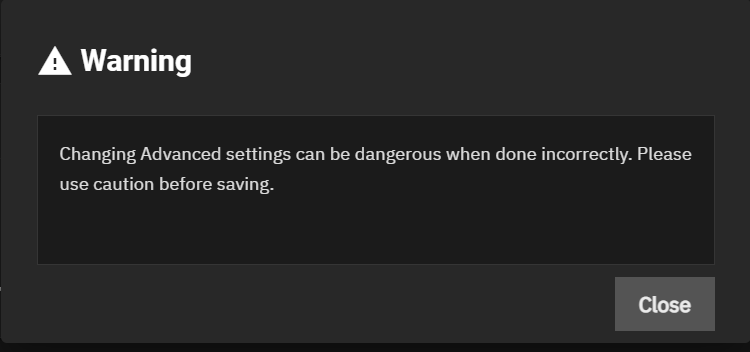
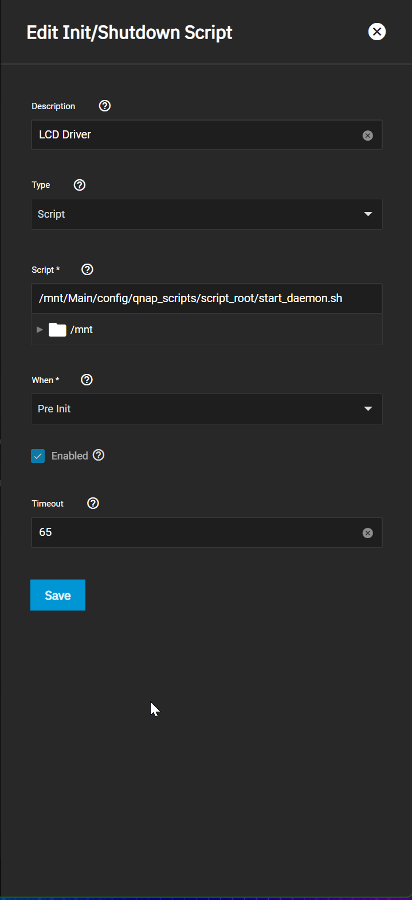

# TrueNAS Scale - QNAP LCD Script

## Installation

> In this example I created a 'config' share and am I executing my script from there.

```bash
ssh root@<<TRUENAS_SCALE_IP/HOSTNAME>>
```

```bash
git clone https://github.com/ITninja04/QNAP_Scale_LCD_Script.git /mnt/Main/config/qnap_scripts
```

```bash
cd /mnt/Main/config/qnap_scripts
```

```bash
# Install dependencies (py-serial for example)
python setup.py install
```

```bash
chmod a+x launcher.sh && chmod a+x start_daemon.sh
```

```bash
./start_daemon.sh
```


## Configuration - Start on Boot
1. Login to admin web console.
2. Choose System Settings -> Advanced 
3. Click _Add_ next to _Init/Shutdown Scripts_
4. Acknowledge the warning

5. Fill out the form!
   6. Description - Go crazy
   7. Type - Script
   8. Script - Navigate to where you cloned the git repo, and choose the _start_daemon.sh_ script file. 
   9. When - Pre Init
   10. Enabled - Checked
   11. Timeout - Anything over 1 will be fine. 
   


